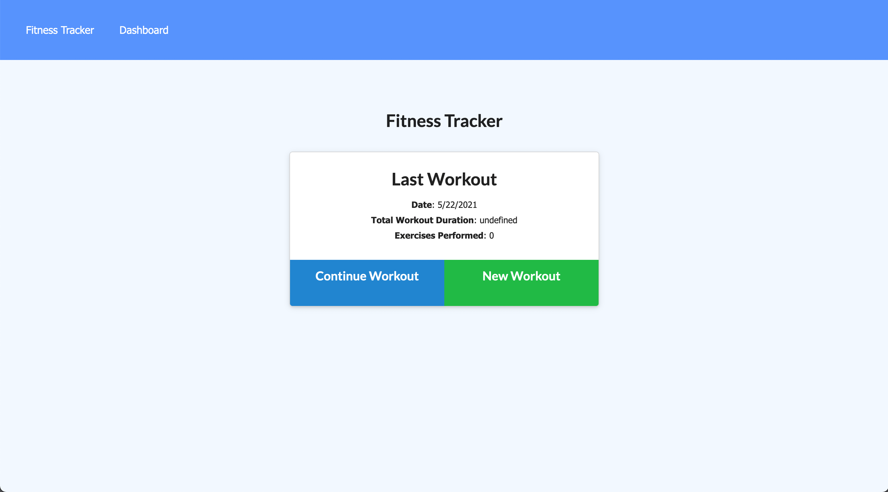
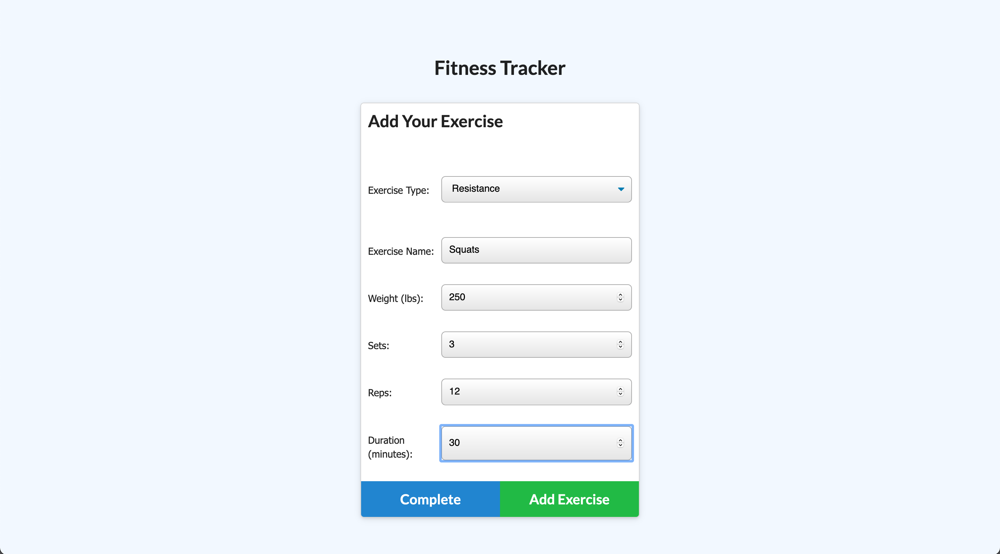
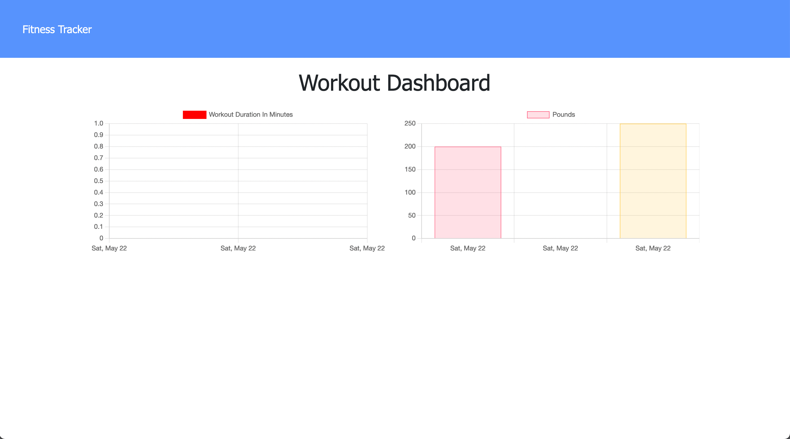

# Fitness Tracker

## Fitness Tracker utilizing mongoDB for a noSQL approach.

## Table of Contents

- [Installation](#Installation)
- [Usage](#Usage)
- [Credits](#Credits)
- [License](#License)

## Installation

Install the Following Dependencies:
Dependencies are included in package.json, so run npm install to get set up. If anything is missing or not working, install express and mongoose, as those are the two most necessary dependencies

## Usage

## Credits

Matt Reisdorf:
Github - [MattReisdorf](https://github.com/MattReisdorf)

## License

The Unlicense

http://unlicense.org/